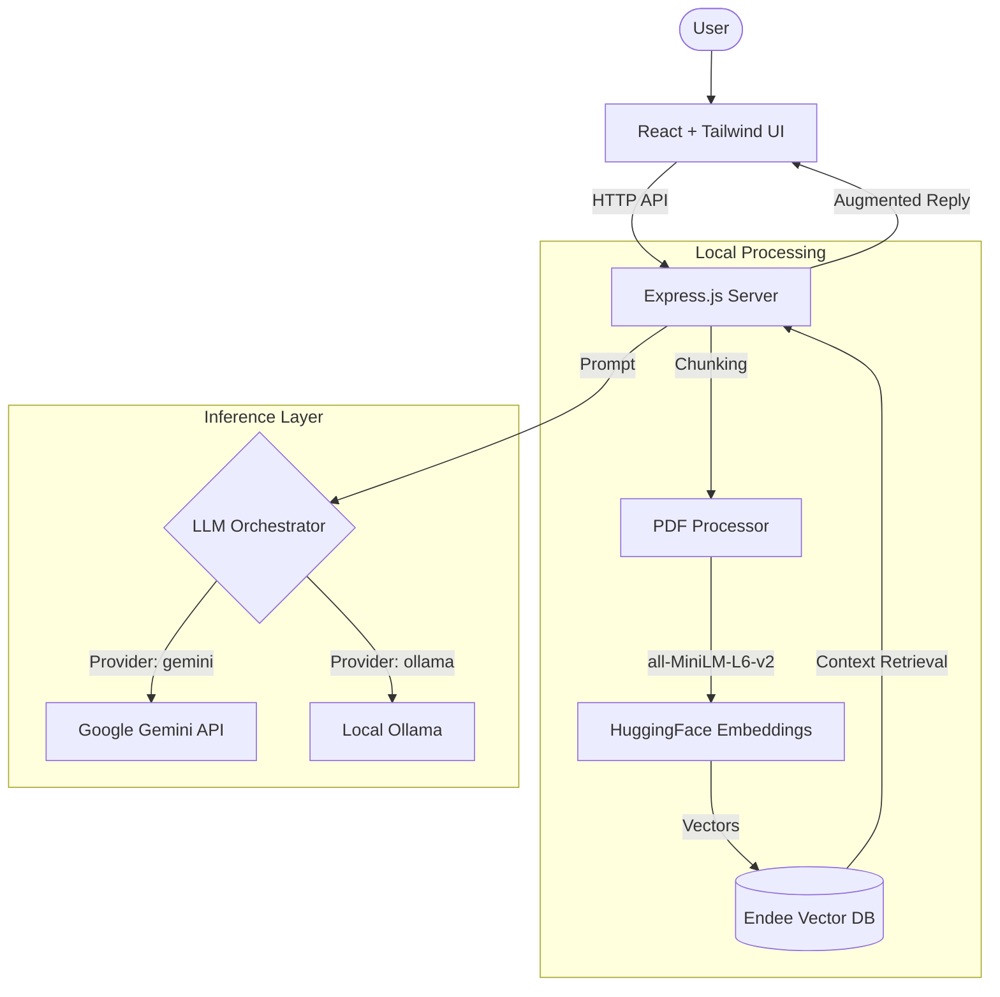

# 🎓 AI Study Assistant: Intelligence for Your Learning

[](https://vitejs.dev/)
[](https://reactjs.org/)
[](https://nodejs.org/)
[](https://tailwindcss.com/)
[](https://github.com/endee-io/endee)

**AI Study Assistant** is a cutting-edge, privacy-focused educational tool designed to help students and researchers interact with their documents like never before. Leveraging **Retrieval-Augmented Generation (RAG)**, it allows you to chat with your PDFs, generate instant quizzes, and get deep insights—all powered by local embeddings and high-performance vector search.

---

## ✨ Key Features

- 📑 **Smart PDF Processing**: Upload complex documents and let the AI extract, chunk, and embed them automatically.
- 💬 **Contextual Chat (RAG)**: Ask questions about your study materials and get answers strictly grounded in your specific documents.
- 📝 **AI Quiz Generation**: Effortlessly generate multiple-choice questions (MCQs) from any part of your text to test your knowledge.
- 🧠 **Hybrid LLM Support**: Use **Ollama** for 100% local privacy or **Google Gemini** for state-of-the-art reasoning.
- ⚡ **High-Performance Vector Search**: Powered by **Endee**, a C++ optimized vector database for instant document retrieval.
- 🎨 **Modern Dark UI**: A sleek, premium dashboard built with React and Tailwind CSS for a distraction-free study experience.

---

## 🚀 Quick Start

### Prerequisites
- [Node.js](https://nodejs.org/) (v18+)
- [Ollama](https://ollama.com/) (Optional, if using local LLM)

### 1. Installation & Setup
Clone the repository and run the automated setup script to install dependencies for both client and server:

```bash
npm run setup
```

### 2. Configure Environment
Create or edit `server/.env`:

```env
PORT=5000
LLM_PROVIDER=gemini # Choose 'gemini' or 'ollama'
GEMINI_API_KEY=your_api_key_here
OLLAMA_MODEL=llama3.2
ENDEE_DB_PATH=./endee-db
```

### 3. Launch the Application

Open two terminal windows/tabs:

**Start the Backend:**
```bash
npm run dev:server
```

**Start the Frontend:**
```bash
npm run dev:client
```

Visit `http://localhost:5173` to start studying!

---

## 📖 How It Works: The RAG Pipeline

1. **Ingestion**: Documents are split into semantic chunks.
2. **Embedding**: Each chunk is transformed into a 384-dimensional vector using the `Xenova/all-MiniLM-L6-v2` model (running locally).
3. **Storage**: Vectors are stored in a high-speed **Endee** collection.
4. **Retrieval**: When you ask a question, the system finds the most relevant document chunks based on semantic similarity.
5. **Generation**: The context is fed to the LLM (Gemini/Ollama) to generate a precise response.

---

## 🛠️ Technology Stack

| Layer | Component | Description |
| :--- | :--- | :--- |
| **Frontend** | React + Vite | Blazing fast development and optimized production build. |
| **Styling** | Tailwind CSS | Utility-first CSS for a custom, premium aesthetic. |
| **Backend** | Express (Node.js) | Robust API handling and service coordination. |
| **Vector DB** | Endee | High-performance C++ vector engine. |
| **LLM** | Gemini / Ollama | Flexible choice between local-first and API-powered AI. |
| **Embeddings** | HuggingFace | Local execution of transformer models for data privacy. |

---

## 📂 Project Structure

```text
├── client/           # React frontend application (Vite)
├── server/           # Node.js backend & API services
│   ├── routes/       # API endpoint definitions
│   ├── services/     # core logic: embedding, LLM, DB
│   └── uploads/      # Temporary storage for processed PDFs
├── docs/             # Technical documentation
└── package.json      # Workspace orchestration
```

---

---

## 🏗️ System Architecture

The AI Study Assistant follows a modular architecture designed for speed and scalability:



---

## 📡 API Reference

### Uploads
- `POST /api/upload`: Handled PDF ingestion, chunking, and vector storage.

### AI Interaction
- `POST /api/chat`: Main RAG interface for document-grounded conversation.
- `POST /api/generate-quiz`: Generates MCQ quizzes based on uploaded content.
- `POST /api/generate-answer`: Provides deep explanations for specific concepts.

### System
- `GET /api/health`: Comprehensive system status check (DB, LLM, and Embeddings).

---

## ⚙️ Advanced Configuration

Fine-tune your assistant's performance in `server/.env`:

| Variable | Default | Description |
| :--- | :--- | :--- |
| `MAX_CHUNK_SIZE` | `800` | Maximum characters per text chunk. Larger = more context, slower. |
| `CHUNK_OVERLAP` | `100` | Overlap between chunks to maintain semantic continuity. |
| `TOP_K_RESULTS` | `5`| Number of document chunks retrieved per query. |
| `OLLAMA_BASE_URL` | `http://localhost:11434` | Point to an external Ollama server if needed. |

---

## 🛠️ Troubleshooting

**1. Ollama Connection Error**
- Ensure Ollama is running (`ollama serve`).
- Pull the model: `ollama pull llama3.2`.
- Check if `LLM_PROVIDER` in `.env` is set to `ollama`.

**2. PDF Processing Fails**
- Ensure the PDF is not password protected.
- Check server logs for file size limit errors (Default is 50MB).

**3. Vector Database Lock**
- If the server crashes, check if `ENDEE_DB_PATH` directory exists and has writing permissions.

---

## 🗺️ Roadmap

- [ ] **Multi-file Support**: Chat across multiple uploaded documents simultaneously.
- [ ] **Image Support**: OCR for scanned documents and images.
- [ ] **Flashcard Export**: Export generated quizzes directly to Anki or Quizlet.
- [ ] **User Authentication**: Save your study history across sessions.
- [ ] **Mobile App**: Optimized mobile interface for studying on the go.

---

## 🤝 Contributing

Contributions are what make the open-source community such an amazing place to learn, inspire, and create. Any contributions you make are **greatly appreciated**.

1. Fork the Project
2. Create your Feature Branch (`git checkout -b feature/AmazingFeature`)
3. Commit your Changes (`git commit -m 'Add some AmazingFeature'`)
4. Push to the Branch (`git push origin feature/AmazingFeature`)
5. Open a Pull Request

---

## 📄 License

Distributed under the **Apache License 2.0**. See `LICENSE` for more information.

---

<p align="center">Built with ❤️ for learners everywhere.</p>

